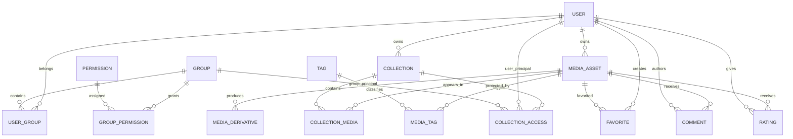

# Initial PostgreSQL Schema

Status: **foundation design**
Date: 2026-09-25

This is the first normalized persistence model for Mediarama. It is intentionally designed from the target domain rather than copied from Coppermine.

## Identifier policy

Use UUIDv7 identifiers for aggregate/entity primary keys where application-generated IDs are useful.

Reasons:

- sortable by creation time;
- safe to expose in URLs/APIs;
- no cross-import sequence collisions;
- suitable for distributed/background creation.

PostgreSQL-native/internal tables may use integer identities where public identity is irrelevant.

## Core entity relationship model

## users

Core fields:

- `id uuid primary key`
- `username varchar(...) unique`
- `email citext unique nullable`
- `password_hash text nullable`
- `display_name text nullable`
- `status varchar`
- `locale varchar nullable`
- `created_at timestamptz`
- `updated_at timestamptz`
- `last_login_at timestamptz nullable`

External/bridged identity support should use a separate identity table rather than overloading the user row.

## groups

- `id uuid primary key`
- `slug varchar unique`
- `name text`
- `is_system boolean`
- timestamps

## user_groups

- `user_id uuid fk users`
- `group_id uuid fk groups`
- `is_primary boolean default false`
- `created_at`
- primary key `(user_id, group_id)`

Enforce at most one primary group per user with a partial unique index.

## permissions / group_permissions

Permissions use stable string keys such as `media.upload`.

`permissions`:

- `key varchar primary key`
- `description text`

`group_permissions`:

- `group_id uuid fk`
- `permission_key varchar fk`
- primary key pair

## media_assets

- `id uuid primary key`
- `owner_id uuid fk users nullable`
- `storage_disk varchar`
- `storage_key text`
- `original_filename text`
- `mime_type varchar`
- `media_type varchar`
- `byte_size bigint`
- `checksum_sha256 char(64)`
- `width integer nullable`
- `height integer nullable`
- `duration_ms bigint nullable`
- `title text nullable`
- `description text nullable`
- `captured_at timestamptz nullable`
- `processing_state varchar`
- `moderation_state varchar`
- `metadata jsonb not null default '{}'`
- `created_at timestamptz`
- `updated_at timestamptz`
- `deleted_at timestamptz nullable`

Constraints:

- byte_size >= 0
- width/height > 0 when present
- duration >= 0 when present
- unique `(storage_disk, storage_key)`

Do not put a collection/album ID on this table.

## media_derivatives

- `id uuid primary key`
- `media_id uuid fk media_assets on delete cascade`
- `kind varchar`
- `profile varchar`
- `processing_version integer`
- `storage_disk varchar`
- `storage_key text`
- `mime_type varchar`
- `byte_size bigint`
- `width integer nullable`
- `height integer nullable`
- `duration_ms bigint nullable`
- `metadata jsonb`
- timestamps

Unique logical derivative:

`(media_id, kind, profile, processing_version)`

## collections

- `id uuid primary key`
- `owner_id uuid fk users nullable`
- `parent_id uuid fk collections nullable` (reserved; hierarchy behavior must be validated before UI reliance)
- `slug varchar nullable`
- `title text`
- `description text nullable`
- `visibility varchar`
- `cover_media_id uuid fk media_assets nullable`
- `position integer default 0`
- timestamps
- `deleted_at nullable`

A collection is not a storage directory.

## collection_media

- `collection_id uuid fk collections on delete cascade`
- `media_id uuid fk media_assets on delete cascade`
- `position integer`
- `added_by uuid fk users nullable`
- `created_at`
- primary key pair

Index `(collection_id, position)`.

This is the structural change that permits one media asset in multiple collections without duplication.

## collection_access

Explicit resource-level policy.

- `id uuid primary key`
- `collection_id uuid fk`
- exactly one of `user_id` / `group_id`
- `capability varchar`
- `effect varchar` (`allow` initially; deny rules only if proven necessary)
- timestamps

Check constraint: exactly one principal column is non-null.

## tags

- `id uuid primary key`
- `slug varchar unique`
- `name text`
- timestamps

## media_tags

- `media_id uuid fk media_assets on delete cascade`
- `tag_id uuid fk tags on delete cascade`
- `source varchar` (manual/imported/embedded)
- primary key pair

## favorites

- `user_id uuid fk users on delete cascade`
- `media_id uuid fk media_assets on delete cascade`
- `created_at`
- primary key pair

## comments

- `id uuid primary key`
- `media_id uuid fk media_assets on delete cascade`
- `user_id uuid fk users nullable`
- `guest_name text nullable`
- `body text`
- `moderation_state varchar`
- timestamps
- `deleted_at nullable`

Do not make IP retention a required comment-domain field. Security/audit retention belongs to a separate policy.

## ratings

- `user_id uuid fk users on delete cascade`
- `media_id uuid fk media_assets on delete cascade`
- `value smallint`
- `created_at`
- `updated_at`
- primary key pair
- check value within configured v1 range

Aggregates are derived/cached, not the source of truth.

## upload_sessions

- `id uuid primary key`
- `user_id uuid fk users`
- `target_collection_id uuid fk collections nullable`
- `original_filename text`
- `expected_size bigint`
- `expected_mime varchar nullable`
- `temporary_storage_key text`
- `status varchar`
- `finalization_media_id uuid nullable unique` — durable MediaAsset reservation used by concurrent/retried finalization
- `expires_at timestamptz`
- `created_at`
- `updated_at`

Parts need not be rows if the selected storage multipart mechanism owns part state. A DB table for parts should only be added if the implementation needs it.

## upload_finalizations

- `upload_session_id uuid primary key fk upload_sessions`
- `media_id uuid unique fk media_assets`
- `processing_dispatched_at timestamptz nullable`
- `created_at timestamptz`

The session reservation is intentionally not a foreign key to `media_assets`: it must exist before filesystem promotion and before the MediaAsset row is durable. The finalization mapping becomes the referential link after persistence. `processing_dispatched_at` records successful enqueueing; a crash after externally visible dispatch but before this marker may cause a duplicate retry, which is safe because media processing is idempotent.

## import_runs

- `id uuid primary key`
- `source_type varchar`
- `source_version varchar nullable`
- `status varchar`
- `options jsonb`
- `progress jsonb`
- `started_at nullable`
- `completed_at nullable`
- timestamps

## import_id_map

- `import_run_id uuid fk import_runs`
- `entity_type varchar`
- `source_id varchar`
- `target_id uuid`
- primary key `(import_run_id, entity_type, source_id)`

This makes Coppermine import resumable and auditable.

## JSONB policy

JSONB is appropriate for:

- raw/extended EXIF/IPTC/XMP metadata;
- codec/probe details;
- importer options/progress;
- derivative processor metadata.

JSONB is **not** appropriate for:

- tags;
- collection membership;
- favorites;
- group membership;
- permissions;
- comments/ratings.

Relationships remain relational.

## Search indexes

Initial search should use PostgreSQL.

Candidate generated/indexed search vector from:

- media title;
- description;
- tag names;
- collection title/description.

Do not create an external search service in v1.

## Deletion policy

Default strategy:

- user-facing MediaAsset/Collection/Comment deletion: soft delete first;
- pure joins/derivatives: cascade where safe;
- original storage deletion: asynchronous cleanup after database state commits;
- user deletion: preserve media attribution via nullable owner where required;
- import records: retain for audit/reconciliation.

Storage deletion is not part of the SQL transaction; it requires retryable cleanup jobs.

## Coppermine mapping validation

This model directly resolves researched legacy patterns:

| Coppermine | Mediarama |
| --- | --- |
| pictures.aid | collection_media |
| pictures.filepath + filename | storage_disk + storage_key + original_filename |
| pictures.user1..4 | metadata/custom-field strategy |
| pictures.keywords + dict | tags + media_tags |
| albums.visibility | collection.visibility + collection_access |
| users.user_group_list | user_groups |
| favpics serialized | favorites |
| exif.exifData serialized | media_assets.metadata |
| votes + aggregate fields | ratings + derived aggregates |
| categories/categorymap | collection hierarchy/policy, migration rule pending |

## Open schema questions

These do not block the foundation:

- whether collection hierarchy is exposed in v1;
- exact custom-field subsystem beyond embedded metadata;
- guest comments in first public release;
- rating scale;
- external identity table shape;
- audit-event retention.

They should not be guessed into the first migration before their features are implemented.
