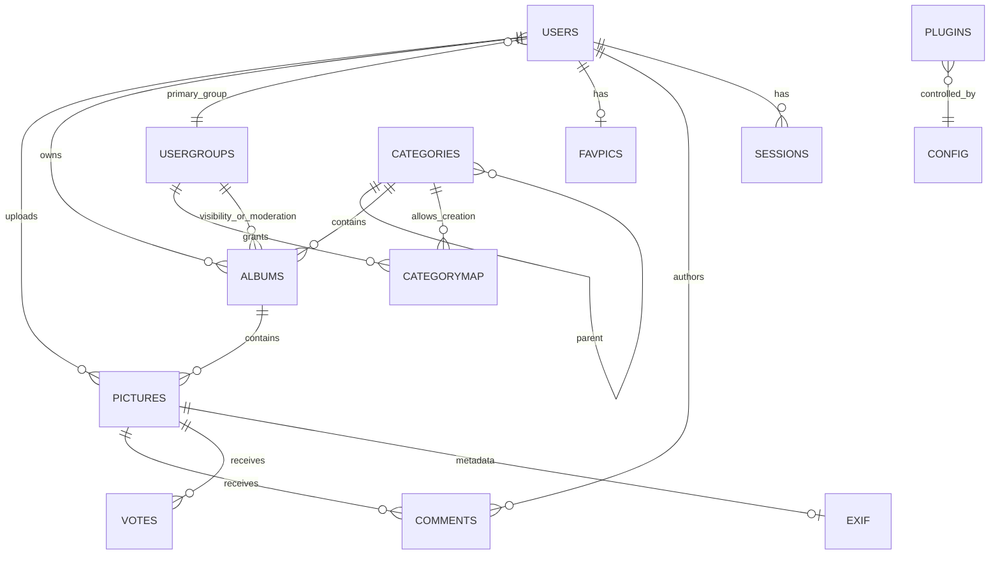

# Coppermine Data Model Analysis

Status: **verified discovery**
Date: 2026-09-25

This document analyzes the Coppermine 1.6.x / 1.7.x database model as a migration source and requirements reference for Mediarama.

It is deliberately separate from the Mediarama target schema. The purpose is to understand the existing semantics before designing replacements.

## Executive summary

Coppermine 1.6.x and 1.7.x contain the same **22 core tables**.

The 1.7 schema is almost identical to 1.6. The only meaningful media-model additions found in 1.7 are:

- `pictures.mime`
- `pictures.ftype`

Later maintenance in 1.6.x changed the IP columns in `hit_stats` and `vote_stats` from `varchar(20)` to `varchar(40)` for IPv6 compatibility. That change is absent from the frozen 1.7 schema.

No SQL foreign-key constraints were found in the 1.6 schema.

The model is mature from a feature perspective, but several storage patterns should **not** be copied into Mediarama:

- relationships enforced only in application code;
- comma-separated group memberships;
- serialized favorites in a text column;
- serialized EXIF in a text column;
- overloaded album visibility values;
- free-form `user1`–`user4` fields;
- storage paths embedded directly into the media record;
- configuration stored as untyped name/value strings.

The right migration strategy is semantic transformation, not table-for-table cloning.

---

## 1. Core tables

Both 1.6.x and 1.7.x define these 22 tables:

| Table | Purpose |
| --- | --- |
| `albums` | Album/container metadata and visibility |
| `banned` | User/IP/email bans |
| `bridge` | External user-system bridge configuration |
| `categories` | Hierarchical gallery categories |
| `categorymap` | Groups allowed to create albums in categories |
| `comments` | Comments on media |
| `config` | Gallery configuration |
| `dict` | Keyword dictionary |
| `ecards` | E-card logging |
| `exif` | Serialized EXIF data |
| `favpics` | Per-user serialized favorites |
| `filetypes` | File extension/MIME/content/player mapping |
| `hit_stats` | Optional detailed hit statistics |
| `languages` | Language definitions/state |
| `pictures` | Main media records |
| `plugins` | Installed/enabled plugins |
| `sessions` | Coppermine sessions |
| `temp_messages` | Temporary cross-page messages |
| `usergroups` | Groups, quotas and permissions |
| `users` | Native Coppermine users |
| `vote_stats` | Optional detailed rating statistics |
| `votes` | Votes/ratings on media |

---

## 2. Schema differences: 1.6.x vs 1.7.x

### Tables

No tables were added or removed.

```text
1.6.x tables: 22
1.7.x tables: 22
```

### Media record additions in 1.7

1.7 adds two columns to `pictures`:

```sql
mime  varchar(255) NOT NULL default 'image/*'
ftype varchar(32)  NOT NULL default 'image'
```

This is directionally useful because it begins to model media type explicitly instead of deriving everything from file extension.

Mediarama should take this idea further and make media type a first-class domain property.

### IP storage divergence

In current 1.6.x:

```sql
hit_stats.ip  varchar(40)
vote_stats.ip varchar(40)
```

In 1.7.x:

```sql
hit_stats.ip  varchar(20)
vote_stats.ip varchar(20)
```

The 1.6 changelog records the 2024 update to accommodate IPv6 addresses.

This is a concrete example of why 1.7 cannot be treated as the automatically more current branch.

---

## 3. Logical entity map

Coppermine does not enforce these relationships through foreign keys, but the schema and application queries establish the following logical model:



The diagram is conceptual. Several relationships are encoded through overloaded integer values, comma-separated strings or application conventions rather than normalized relational tables.

---

## 4. Albums

The `albums` table contains:

- `aid`
- `title`
- `description`
- `visibility`
- `uploads`
- `comments`
- `votes`
- `pos`
- `category`
- `owner`
- `thumb`
- `keyword`
- `alb_password`
- `alb_password_hint`
- `moderator_group`
- `alb_hits`

### Useful concepts

Mediarama should preserve the product concepts of:

- titled media collections;
- descriptions;
- ownership;
- ordering;
- designated cover/thumbnail;
- upload policy;
- comment/rating policy;
- protected/private collections;
- moderators;
- access control.

### Architectural problem: overloaded visibility

Coppermine checks `albums.visibility` against values such as:

- `0` for general visibility;
- IDs present in `USER_GROUP_SET`;
- user-gallery identifiers involving `FIRST_USER_CAT + USER_ID`;
- password handling in parallel.

This combines several authorization concepts into a compact but difficult-to-reason-about field.

### Mediarama direction

Do not copy `visibility` directly.

Prefer an explicit policy model, e.g.:

```text
Collection
- visibility: public | authenticated | private | restricted
- owner_id
- password_protection? (if retained)

CollectionAccess
- collection_id
- principal_type: user | group
- principal_id
- capability: view | upload | moderate | manage
```

This design is illustrative, not final.

---

## 5. Categories

`categories` is a hierarchical tree containing:

- `cid`
- `owner_id`
- `name`
- `description`
- `pos`
- `parent`
- `thumb`
- `lft`
- `rgt`
- `depth`

Coppermine therefore maintains both:

- parent references;
- nested-set fields (`lft`, `rgt`, `depth`).

This allows efficient hierarchical traversal but duplicates hierarchy state and requires careful maintenance.

### Mediarama question

We need to decide whether Mediarama actually requires a separate Category concept in addition to Albums/Collections.

Possible options:

1. retain hierarchical categories above collections;
2. make collections nestable;
3. use tags/facets for taxonomy and keep collections flat;
4. support both nested collections and tags.

This should be decided from product requirements rather than copied from Coppermine.

---

## 6. Category creation permissions

`categorymap` is one of the cleaner relational structures in Coppermine:

```text
categorymap
- cid
- group_id
- PRIMARY KEY (cid, group_id)
```

Application code uses it to determine which groups can create public albums in which categories.

This concept is worth preserving, but Mediarama should generalize it into explicit authorization policies instead of a category-specific permission table if the same permission model is needed elsewhere.

---

## 7. Media: `pictures`

The main media table in 1.6 contains:

- identity: `pid`
- album: `aid`
- storage: `filepath`, `filename`, `url_prefix`
- sizes: `filesize`, `total_filesize`
- dimensions: `pwidth`, `pheight`
- timestamps: `mtime`, `ctime`
- ownership: `owner_id`
- popularity: `hits`
- rating aggregates: `pic_rating`, `votes`
- content: `title`, `caption`, `keywords`
- moderation: `approved`
- icon/representation: `galleryicon`
- custom fields: `user1`–`user4`
- IP data: `pic_raw_ip`, `pic_hdr_ip`, `lasthit_ip`
- ordering: `position`
- guest editing: `guest_token`

1.7 adds:

- `mime`
- `ftype`

### Important strength

Coppermine correctly separates media bytes from database metadata. Files remain in storage while the database records where they are and how they belong to the gallery.

### Important weakness

The storage identity is tightly coupled to:

```text
CONFIG.fullpath + pictures.filepath + pictures.filename
```

That assumption appears throughout the application.

### Mediarama direction

Use an abstract storage identity:

```text
MediaAsset
- id
- storage_disk
- storage_key
- original_filename
- mime_type
- media_type
- byte_size
- width
- height
- duration
- owner_id
- moderation_state
- created_at
- captured_at
- title
- description
```

URLs should be derived by a storage service, not stored as the media identity.

---

## 8. One album per media record

Coppermine stores `pictures.aid`, so every picture/media record has one primary album relationship.

Keywords can make content appear through additional search/meta-album mechanisms, but the persisted relation remains one media record → one album.

### Mediarama decision required

For a modern media library, the more flexible model is likely:

```text
MediaAsset
Collection
CollectionMedia
- collection_id
- media_id
- position
```

That allows:

- one asset in multiple collections;
- no file duplication;
- independent ordering per collection;
- smart/dynamic collections later.

This should be treated as a likely Mediarama improvement.

---

## 9. Custom metadata

Coppermine has generic media fields:

- `user1`
- `user2`
- `user3`
- `user4`

Their labels can be configured, but the schema is fixed.

### Mediarama direction

Avoid numbered generic columns.

Candidates:

- normalized typed custom-field tables;
- JSONB metadata for flexible, non-relational properties;
- a hybrid of indexed first-class columns plus JSONB extension metadata.

This is one of the strongest arguments for evaluating PostgreSQL.

---

## 10. EXIF and IPTC

Coppermine supports EXIF and IPTC processing.

The `exif` table is:

```text
exif
- pid
- exifData TEXT
```

Application code serializes/unserializes EXIF into that text field.

IPTC is parsed by application code and can be used when displaying/importing metadata.

### Mediarama direction

Do not persist PHP-serialized metadata.

Prefer:

```text
media.metadata JSON/JSONB
```

for raw/extensible metadata plus selected normalized columns for fields that must be queried frequently, such as:

- captured_at
- camera_make
- camera_model
- lens
- focal_length
- exposure
- aperture
- iso
- GPS coordinates where permitted
- copyright/creator

The raw metadata representation should remain versionable and application-language independent.

---

## 11. Keywords

Coppermine stores picture keywords as:

```text
pictures.keywords varchar(255)
```

and maintains a separate `dict` table containing unique keywords.

This provides searchable keyword functionality but is not a normalized many-to-many tag relation.

### Mediarama direction

Use first-class tags:

```text
Tag
MediaTag
CollectionTag
```

This improves:

- integrity;
- rename behavior;
- indexing;
- faceted search;
- usage counts;
- future namespaces/taxonomies.

---

## 12. Users

Native Coppermine users include:

- primary group: `user_group`
- additional groups: `user_group_list`
- active state
- username/password
- password hashing metadata
- registration/last visit
- email
- six generic profile fields
- activation key
- language

### Major normalization issue

`user_group_list` is a comma-separated string.

Application code repeatedly parses and reconstructs it.

### Mediarama direction

Use a proper join table:

```text
User
Group
UserGroup
- user_id
- group_id
```

If one primary group remains useful, it can be represented explicitly, but permissions should not depend on parsing text.

---

## 13. User groups and permissions

`usergroups` stores:

- quota
- admin access
- rate permission
- e-card permission
- comment permission
- upload permission
- create-album permission
- public upload approval requirement
- private upload approval requirement
- access level

This is a mature feature set but a fixed permission schema.

### Mediarama direction

Use explicit permissions/capabilities.

Potential model:

```text
Permission
- media.upload
- media.comment
- media.rate
- collection.create
- collection.manage
- moderation.approve
- admin.access

GroupPermission
UserPermissionOverride (optional)
```

Do not hard-code every future capability as a new boolean group column.

---

## 14. Favorites

Coppermine stores one record per user in `favpics`:

```text
favpics
- user_id
- user_favpics TEXT
```

The favorites list is serialized and base64-encoded by the application.

### Mediarama direction

Normalize it:

```text
Favorite
- user_id
- media_id
- created_at
PRIMARY KEY (user_id, media_id)
```

This makes favorites queryable, indexable and migration-safe.

---

## 15. Comments

Comments have their own table and support:

- media relation;
- author name;
- registered-user author ID;
- body;
- date;
- IP information;
- approval;
- spam state.

The distinction between anonymous and registered comments is useful.

### Mediarama direction

Preserve moderation semantics, but model author identity cleanly:

```text
Comment
- id
- media_id
- user_id nullable
- guest_name nullable
- body
- moderation_state
- created_at
```

IP retention should be a privacy/security policy decision rather than automatically copied.

---

## 16. Ratings

Coppermine has:

- aggregate rating data on `pictures`;
- individual `votes`;
- optional detailed `vote_stats`.

This duplicates derived values for performance.

### Mediarama direction

Keep individual ratings/votes as the source of truth.

Aggregates can be:

- calculated;
- cached;
- materialized;
- maintained transactionally if required.

Do not make migration dependent on Coppermine's aggregate fields being perfectly consistent.

---

## 17. Hit statistics

Coppermine can store detailed views including:

- media ID;
- IP;
- search phrase;
- timestamp;
- referrer;
- browser;
- OS;
- user ID.

This is historically useful but privacy-heavy and duplicates functionality commonly handled by modern analytics systems.

### Mediarama decision

Do not automatically reproduce full hit logging.

Separate:

- product counters such as view_count;
- audit/security events;
- analytics.

This reduces database growth and privacy risk.

---

## 18. File types

`filetypes` maps:

- extension;
- MIME;
- content type;
- player.

This allows Coppermine to support images, video, audio and documents.

### Mediarama direction

Preserve configurable type handling but do not trust extension alone.

The upload pipeline should determine type from:

- detected MIME;
- content inspection;
- allowed policy;
- optional extension consistency check.

---

## 19. Configuration

`config` stores:

```text
name varchar(40)
value varchar(255)
```

This is flexible but completely untyped.

### Mediarama direction

Configuration should distinguish:

- environment/deployment configuration;
- secrets;
- application settings;
- per-user preferences.

Typed application settings may still use a key/value mechanism, but validation and schemas should exist outside raw strings.

Secrets should not be stored in an ordinary application settings table.

---

## 20. Plugin registry

`plugins` stores:

- ID
- name
- enabled state
- path
- priority

This is a useful minimal registry.

Mediarama can preserve the concepts of enabled state and event priority, while decoupling extensions from arbitrary filesystem paths where possible.

---

## 21. Bridging

Coppermine can delegate authentication/user integration to external forum/community systems through bridge configuration and bridge implementations.

This is historically valuable product knowledge.

### Mediarama interpretation

Do not recreate each legacy bridge.

Modern equivalents should be evaluated instead:

- OpenID Connect;
- OAuth 2.x where appropriate;
- SAML for enterprise use if ever required;
- external identity provider adapters.

A Coppermine migration should import native users where possible but must treat bridged installations separately because Coppermine may not own their user records.

---

## 22. Sessions and temporary messages

Coppermine stores sessions and transient cross-page messages in dedicated tables.

A modern framework can provide these facilities.

Mediarama should avoid designing custom session infrastructure unless a specific requirement demands it.

---

## 23. Missing database-enforced integrity

No `FOREIGN KEY` declaration was found in the Coppermine 1.6.x schema.

That means integrity such as:

- picture → album;
- album → category;
- album → owner;
- comment → picture;
- comment → user;
- EXIF → picture;
- categorymap → category/group;

is primarily enforced by application behavior.

### Mediarama direction

Use foreign keys for stable domain relationships unless there is a documented reason not to.

Also define explicit deletion policies:

- cascade;
- restrict;
- set null;
- archival/soft deletion.

Deletion semantics must be designed before migration tooling is finalized.

---

## 24. Proposed Mediarama domain boundaries

A likely first decomposition is:

### Identity & Access

- User
- Group
- Role/Permission
- UserGroup
- Ban / SecurityEvent

### Media Library

- MediaAsset
- MediaDerivative
- MediaMetadata
- StorageObject

### Organization

- Collection
- CollectionMedia
- Tag
- MediaTag
- optional Category/Folder hierarchy

### Interaction

- Comment
- Rating
- Favorite

### Platform

- Plugin/Extension
- Setting
- AuditEvent
- MigrationRecord

This is intentionally conceptual. Physical database tables should follow after the architecture/database ADRs.

---

## 25. Migration mapping hypothesis

Initial mapping:

| Coppermine | Mediarama |
| --- | --- |
| `pictures` | `MediaAsset` + storage + metadata |
| `albums` | `Collection` |
| `categories` | Category/folder or nested collection, decision pending |
| `categorymap` | authorization policy |
| `users` | `User` |
| `usergroups` | `Group` + permissions |
| `user_group_list` | `UserGroup` rows |
| `comments` | `Comment` |
| `votes` | `Rating` |
| `favpics` | `Favorite` rows |
| `exif` | metadata JSON + indexed normalized fields |
| `dict` + picture keywords | `Tag` + `MediaTag` |
| `filetypes` | upload/type policy |
| `plugins` | extension registry, where compatible |
| `config` | selectively transformed settings |
| `bridge` | migration/identity special case |
| statistics tables | selective import only |

---

## 26. PostgreSQL implications

The schema analysis strengthens the case for PostgreSQL, particularly for:

- normalized relational integrity;
- JSONB media metadata;
- indexed structured metadata;
- many-to-many tagging;
- many-to-many collections;
- explicit authorization relations;
- future full-text/faceted search.

However, MySQL/MariaDB can also support a clean normalized design.

The database decision should therefore compare **target Mediarama requirements**, not Coppermine compatibility.

Migration can cross database engines.

---

## 27. Decisions now strongly indicated

These are not yet formal ADRs, but the research now strongly points toward:

1. Do not clone the Coppermine schema.
2. Do not make one album ID a property of the media asset itself.
3. Do not store group membership as text.
4. Do not store favorites as serialized text.
5. Do not store EXIF as PHP serialization.
6. Do not use numbered custom metadata columns.
7. Do not encode access policy in one overloaded integer.
8. Use database-enforced referential integrity.
9. Separate physical storage identity from public URL/path.
10. Treat Coppermine migration as transformation into the new domain model.

---

## 28. Next research step

The next discovery work is the **upload and media-processing pipeline**:

- all upload entry points;
- chunked upload behavior;
- batch-add flow;
- validation;
- quota checking;
- approval;
- MIME/type handling;
- image resize;
- intermediate images;
- thumbnails;
- EXIF/IPTC extraction;
- watermarking;
- database insertion;
- error/rollback behavior;
- plugin hooks.

That work will define the Mediarama ingestion pipeline and background-processing requirements.
